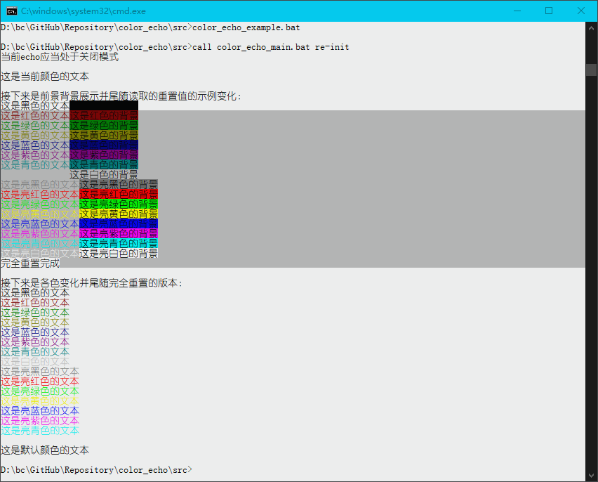

# color_echo

Color Echo library for Windows CMD.

这是一个为Windows CMD开发的彩色显示加载库。

## 介绍

使用这个程序加载后，就可以在输出时方便地切换色彩了。可用的色彩，见`color_echo_define.bat`中的定义。

通常来说，程序的主文件是`color_echo_main.bat`。但是如果您不需要自动配置单独的前景色重置或背景色重置，也不需要自动启用彩色支持，您也可以直接调用`color_echo_define.bat`，这样运行速度更快。

> 目前的`color_echo_main.bat`会尝试从注册表读取配置，这一步在部分电脑上可能有时会卡慢。

## 效果展示

## 

## 下载

1. 您可以从[*Release*（发布）区](https://github.com/LiuJiewenTT/color_echo/releases)下载压缩包，直接解压即可使用。
2. 您可以点击网页上的*Code*直接获取整个项目，不过并不推荐这么做。

## 使用

查看示例和效果：

``` cmd
color_echo_example.bat
```

查看帮助：

``` cmd
color_echo_main.bat --help
```

您可以在调用前设置`screen_color`的值，可用值与使用`color`命令是一致的。`screen_color`的值会影响单独前景色重置和单独背景色重置的设置。

> 若环境变量中无`screen_color`，程序会从注册表中读取。使用的注册表项可以通过设置环境变量`console_reg_config`进行更改。

三项重置变量：

1. `CE_RESET`: 完全重置，包括字体等。
2. `FG_RESET`: 仅重置前景色。
3. `BG_RESET`: 仅重置背景色。

可使用的颜色变量：

通式：

``` cmd
[FG|BG]_[COLOR_NAME|COLOR_[0-15|0-f]]
```

例：

1. *FG_RED*
2. *BG_COLOR_0*
3. *FG_COLOR_e*

解释：

1. 首先一定是前缀`FG`或`BG`。
2. 接着可以是颜色名，也可以是颜色序号。
3. 如果使用颜色序号，有两种：
   1. 一种是`0`到`15`，十进制，共16种颜色。
   2. 一种是`0`到`f`（小写），十六进制，共16中颜色。

> 暂时没有支持大写的打算，因为没有必要，并且增加大写的支持会让代码多出不少。

